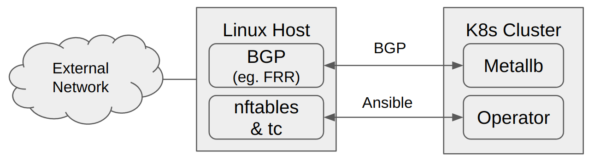

## Linux NFT/Traffic Control k8s Operator

[](http://www.apache.org/licenses/LICENSE-2.0.html)

This k8s operator works in conjunction with Metallb configured in BGP Mode and a Linux Router
to create a LoadBalancer structure for k8s applications.


## How it works

</img>

The operator reads the metallb configmap and uses variables in its custom resource defination to
create a nftables configuration and transfers the configuration to the linux router.

When a Network Service is created with a LoadBalancer configured, Metallb allocates an IP address
from its configured pool and advertizes to the router.

The operator watches for the creation of services and updates firewall rules to ensure that only
the specific address and port transit the router.  

If configured, the operator will also apply ingress rate limiting by configured linux
traffic control on the public interface.  By adding an annotation to the Service Metadata
the rate limit will be applied.  

For more information on [metallb]


## Prerequisites

- Linux host for Router - Ubuntu 18.04 LTS recommended
- Routing software on Linux host -  [FRRouting][frr]
- NFT installed on Linux Host - [nft website][nft]

```
# Stop and remove iptables (recommended for simplicty) 
$ sudo systemctl stop iptables
$ sudo apt -y remove iptables

# Install nft and enable 
$ sudo apt -y install nftables
$ sudo systemctl enable nftables.service 
```
- k8s cluster with [Metallb][metallb] installed

- Configure linux router for bgp (frr) - bgp needs to be peered to each node running
the bgp speaker

```
$ kubectl get pods -o wide
NAME                         READY   STATUS    RESTARTS   AGE   IP              NODE
controller-dc7447947-snw28   1/1     Running   10         10d   10.244.0.241    k8s1
speaker-7x4bq                1/1     Running   37         56d   172.30.250.11   k8s2
speaker-hbnxp                1/1     Running   36         56d   172.30.250.10   k8s1
speaker-kxf68                1/1     Running   37         56d   172.30.250.12   k8s3
```

Example simple frr configuraiton

```
frr# show run
Building configuration...

Current configuration:
!
frr version 7.2.1
frr defaults traditional
hostname frr
log file /var/log/frr/log
service integrated-vtysh-config
!
router bgp 65551
 bgp log-neighbor-changes
 neighbor 172.30.250.10 remote-as external
 neighbor 172.30.250.11 remote-as external
 neighbor 172.30.250.12 remote-as external
 !
 address-family ipv4 unicast
  redistribute connected
 exit-address-family
!
line vty
!
end
```

## Installation of nft-operator

1. Setup Router access for operator.  The ansible operator configures the Router over SSH, requiring that the router has access and the account keys.

```
# Add ansible-operator user
$ sudo useradd ansible-operator -m -u 1001 -s /bin/bash
# set a temp password for the ansible-operator user
```
2.  Create ssh keys on host with kubectl configured for cluster.  As the ansible operator connects to the router, the private key for the ansible-operator user is stored as a k8s secret and projected into the operator containers.  (Setting RBAC to restrict access is recommended)

```
$ ssh-keygen -f ansible-operator -t rsa

# copy keys to Router
$ ssh-copy-id -i ansible-operator.pub ansible-operator@172.30.250.1

# check keys
$ ssh -o "IdentifiesOnly=yes" -i ansible-operator ansible-operator@172.30.250.1

# add private key to k8s secrets

$ kubectl create namespace arbf-operators

$ kubectl -n arbf-operators create secret generic ansible-operator-ssh --from-file=ansible-operator

# Recommend:  removing the keys from the host after installation complete and verified
```

3.  Install the Operator

To install the nft-operator, apply this manifest:

```
$ kubectl apply -f https://raw.githubusercontent.com/acnodal/arbf-nft-operator/master/manifests/arbf-nft-operator.yml  
```
This will deploy the nft-operator in your cluster in the arbf-operators namespace.  The components of the manifest are:

 - Custom Resource Definations
 - Service Account, Roles & Role Bindings required by the operator
 - The nft-operator


3. Configure the Operator

The operator is configured using custom resource

```
$ kubectl -n arbf-operators nft nft
```
The only default variable that must be verified is the public_nic identifying the interface that provides public access to the cluster.


- public_nic: enp1s0  - Sets the public nic, the nic that nft firewall rules are applied.
 - enable_bgp: true  Installs a firewall rule that allows BGP peers to connect via the public interface.  This is used if the router if peer to an other bgp routers.  

- enable_dropall: true   - If set to false the unmatched behavior of nft will be  accept.  Useful for testing
- enable_rateshape: true  - When set to true, the ingress queue manager is added to the public_nic and an ingress rate shaper table is created.  The table is populated when a loadbalanced service is annotated with rate
- enable_ssh: true  - Installs a firewall fule that allows ssh access to the linux router (INPUT) from public_nic


In addition to the automated rules, a ruleset called local-chain (/etc/nftables.d/local-chain.nft) is created on the linux router.  Entries added to this table will not be changed by the operator. eg. additing a rule for debugging

```
chain local-chain {
# add local chains here.  Will not be updated by operator
		ip saddr 192.168.151.100  counter accept
        }
```

4. Using the Operator

Once configured the operator reads k8s services to create rulesets.  The operator is watching for Service events and creates/updates the rules as new services are created.  The operator also reconciles every 60 seconds (by default) updated all rules at that time.  One of the benefits of NFT is that a complete ruleset can be swapped in a single operation avoiding an inconsistent state. 

To use the ratelimit functionality, annotate the service defination with ratelimit.  

The syntax is:
```
ratelimit:  <value> <unit> [burst <value> <unit>]
```
eg. 

```
apiVersion: v1
kind: Service
metadata:
  name: hello-kubernetes-3
  annotations:
    ratelimit: 2 mbytes/second burst 512 kbytes
spec:
  type: LoadBalancer
  ports:
  - port: 80
    targetPort: 8080
  selector:
    app: hello-kubernetes-3
```
The further information on the limitcommands is [here][limit] 

> Note well.  NFT syntax is very specific, therefore if the incorrect syntax is used for ratelimit, nft will not update the tables.  This will not create a security problem as the previous tables will remain in place however services will not be updated.   A future enhancement may check ratelimit syntax.


5. Troubleshooting

Troubleshooting consists of checking the operator and the linux router.

Checking the status of the operator

```
$ kubectl -n arbf-operators get nft -o yaml
apiVersion: v1
items:
- apiVersion: nft.acnodal.com/v1alpha1
  kind: Nft
  metadata:
    annotations:
      ansible.operator-sdk/verbosity: "4"
    creationTimestamp: "2020-02-28T14:47:21Z"
    generation: 2
    name: nft
    namespace: arbf-operators
    resourceVersion: "3507011"
    selfLink: /apis/nft.acnodal.com/v1alpha1/namespaces/arbf-operators/nfts/nft
    uid: e535336f-0362-406d-adf6-0f3f212b5388
  spec:
    enable_bgp: true
    enable_dropall: true
    enable_rateshape: true
    enable_ssh: true
    public_nic: enp1s0
  status:
    conditions:
    - lastTransitionTime: "2020-02-28T16:05:35Z"
      message: Running reconciliation
      reason: Running
      status: "True"
      type: Running
kind: List
metadata:
  resourceVersion: ""
  selfLink: ""
```

Inspecting the operator logs will show output familar to ansible users.  Note that the pod contains two containers, the ansible container shows the ansible output

```
$ kubectl -n arbf-operators logs arbf-nft-operator-55d6b4754c-whx78 -c ansible
```

Checking the status of the router.  

Login to the linux router.  Entries should match services with loadbalancer addresses allocated

```
$ sudo  vtysh -c 'show ip route'
Codes: K - kernel route, C - connected, S - static, R - RIP,
       O - OSPF, I - IS-IS, B - BGP, E - EIGRP, N - NHRP,
       T - Table, v - VNC, V - VNC-Direct, A - Babel, D - SHARP,
       F - PBR, f - OpenFabric,
       > - selected route, * - FIB route, q - queued route, r - rejected route

B   0.0.0.0/0 [20/0] via 172.30.255.1, enp1s0, 01:39:07
K>* 0.0.0.0/0 [0/100] via 172.30.255.1, enp1s0, 01:39:11
B>* 10.0.8.0/24 [20/0] via 172.30.255.1, enp1s0, 01:39:07
B>* 10.0.8.2/32 [20/1] via 172.30.255.1, enp1s0, 01:39:07
B>* 98.179.160.0/23 [20/1] via 172.30.255.1, enp1s0, 01:39:07
C>* 172.30.250.0/24 is directly connected, enp6s0, 01:39:11
B>* 172.30.254.1/32 [20/0] via 172.30.250.10, enp6s0, 01:37:18
  *                        via 172.30.250.11, enp6s0, 01:37:18
  *                        via 172.30.250.12, enp6s0, 01:37:18
B>* 172.30.254.2/32 [20/0] via 172.30.250.10, enp6s0, 01:37:18
  *                        via 172.30.250.11, enp6s0, 01:37:18
  *                        via 172.30.250.12, enp6s0, 01:37:18
B>* 172.30.254.3/32 [20/0] via 172.30.250.10, enp6s0, 01:37:18
  *                        via 172.30.250.11, enp6s0, 01:37:18
  *                        via 172.30.250.12, enp6s0, 01:37:18
B>* 172.30.254.4/32 [20/0] via 172.30.250.10, enp6s0, 01:37:18
  *                        via 172.30.250.11, enp6s0, 01:37:18
  *                        via 172.30.250.12, enp6s0, 01:37:18
B>* 172.30.254.5/32 [20/0] via 172.30.250.10, enp6s0, 01:37:18
  *                        via 172.30.250.11, enp6s0, 01:37:18
  *                        via 172.30.250.12, enp6s0, 01:37:18
C>* 172.30.255.0/24 is directly connected, enp1s0, 01:39:11
B>* 192.168.151.0/24 [20/1] via 172.30.255.1, enp1s0, 01:39:07


$ sudo nft list ruleset
table inet filter {
	chain global {
		iif "lo" accept
		iif != "enp1s0" ct state new accept
		ct state established,related accept
		ct state invalid drop
		ip protocol icmp accept
		ip6 nexthdr ipv6-icmp accept
		iif "enp1s0" tcp sport domain accept
		iif "enp1s0" udp sport domain accept
	}

	chain local-chain {
		ip saddr 192.168.151.100 counter packets 267 bytes 18200 accept
	}

	chain operator-cr {
		iif "enp1s0" tcp dport bgp accept
		iif "enp1s0" tcp dport ssh accept
	}

	chain operator-svc {
		counter packets 0 bytes 0
		iif "enp1s0" ip daddr 172.30.254.2 tcp dport http accept
		iif "enp1s0" ip daddr 172.30.254.5 tcp dport 5201 accept
		iif "enp1s0" ip daddr 172.30.254.1 tcp dport http accept
		iif "enp1s0" ip daddr 172.30.254.4 tcp dport http accept
		iif "enp1s0" ip daddr 172.30.254.3 tcp dport http accept
	}

	chain input {
		type filter hook input priority 0; policy drop;
		counter packets 300 bytes 21312
		jump local-chain
		counter packets 33 bytes 3112
		jump operator-cr
		counter packets 33 bytes 3112
		jump global
		counter packets 3 bytes 375
	}

	chain forward {
		type filter hook forward priority 0; policy drop;
		counter packets 0 bytes 0
		jump local-chain
		counter packets 0 bytes 0
		jump operator-svc
		counter packets 0 bytes 0
		jump global
		counter packets 0 bytes 0
	}
}
table netdev filter {
	chain operator-tc {
		ip daddr 172.30.254.2 tcp dport http limit rate over 1 mbytes/second drop
		ip daddr 172.30.254.5 tcp dport 5201 limit rate over 1 mbytes/second drop
		ip daddr 172.30.254.3 tcp dport http limit rate over 2 mbytes/second burst 512 kbytes drop
	}

	chain ratelimit {
		type filter hook ingress device enp1s0 priority 0; policy accept;
		jump operator-tc
	}
}
```

Rules updates can be monitored using

```
$ sudo nft monitor ruleset
```
The rules are contained in /etc/nftables.conf and /etc/nftables.d/


[frr]: https://frrouting.org
[metallb]: https://metallb.universe.tf
[nft]: https://wiki.nftables.org 
[linuxtc]: https://tldp.org/HOWTO/Traffic-Control-HOWTO/index.html
[limit]: https://wiki.nftables.org/wiki-nftables/index.php/Quick_reference-nftables_in_10_minutes#Limit